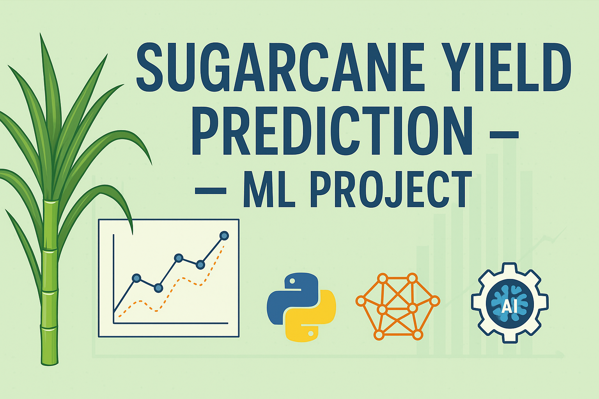

  

<h1 align="center">🌾 Sugarcane Yield Prediction</h1>

  Predicting sugarcane crop yield using machine learning techniques on real-world agricultural data.

---

## 📌 Overview

This project focuses on using regression-based machine learning models to **predict sugarcane yield** from agricultural input data like soil nutrients, rainfall, temperature, and more.

The notebook includes:
- 🔍 Data preprocessing and cleaning
- 📊 Feature engineering
- 📈 Visualizations and correlation analysis
- 🤖 Regression model training
- 📉 Model evaluation with R² Score, MAE, RMSE

---

## 📂 Project Structure

